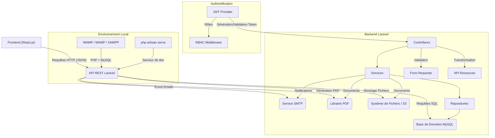

# ARCHITECTURE TECHNIQUE : Système de Gestion Numérique des Soutenances Universitaires

Ce document décrit l'architecture technique du projet Backend, basée sur Laravel, en détaillant les composants, leurs interactions et les principes de conception adoptés. Il sert de guide pour l'équipe de développement Backend.

## 1. Vue d'Ensemble de l'Architecture

Le système est conçu comme une application web **MVC (Modèle-Vue-Contrôleur)** à trois niveaux, avec un backend **API RESTful** développé en Laravel, une base de données **MySQL** et un frontend découplé (qui sera développé par l'équipe Frontend).

## 2. Principes de Conception

*   **Séparation des Préoccupations (SoC) :** Chaque composant a une responsabilité unique et bien définie.
*   **SOLID Principles :** Respect des principes de conception orientée objet pour un code maintenable et extensible.
*   **Domain-Driven Design (DDD) Léger :** Organisation du code autour des concepts métier (Domaines) pour une meilleure compréhension et évolutivité.
*   **API-First :** Le backend est conçu comme une API RESTful, indépendante du frontend, permettant une consommation par diverses applications clientes.
*   **Stateless (pour les API) :** Les requêtes API ne dépendent pas de l'état de la session côté serveur, facilitant la scalabilité.
*   **Testabilité :** Le code est écrit de manière à être facilement testable (unitaires, fonctionnels).

## 3. Composants du Backend Laravel

### 3.1. Couche HTTP (Entrée)

*   **Contrôleurs (`app/Http/Controllers`) :** Point d'entrée des requêtes HTTP. Ils sont légers et se contentent de déléguer la logique métier aux services, de valider les requêtes et de formater les réponses.
*   **Form Requests (`app/Http/Requests`) :** Classes dédiées à la validation des données entrantes des requêtes HTTP. Elles garantissent que les données sont conformes aux attentes avant d'atteindre la logique métier.
*   **API Resources (`app/Http/Resources`) :** Transforment les modèles Eloquent en structures de données JSON optimisées pour les réponses API, assurant une cohérence et une flexibilité dans la présentation des données.

### 3.2. Couche Service (Logique Métier)

*   **Services (`app/Services`) :** Contiennent la logique métier complexe et orchestrent les opérations entre les repositories, les modèles et les autres services. Chaque service est dédié à un domaine fonctionnel (ex: `DefenseService` gère la création, la mise à jour des soutenances, la vérification des conflits).

### 3.3. Couche Persistance (Accès aux Données)

*   **Repositories (`app/Repositories`) :** Abstraient la logique d'accès aux données de la base de données. Ils fournissent une interface pour les opérations CRUD sur les entités, permettant de changer la technologie de persistance sans impacter la logique métier.
*   **Modèles Eloquent (`app/Models`) :** Représentent les tables de la base de données et gèrent les relations entre elles. Ils contiennent également les accesseurs, mutateurs et scopes.
*   **Migrations (`database/migrations`) :** Gèrent l'évolution du schéma de la base de données.

### 3.4. Couche Authentification et Autorisation

*   **JWT (JSON Web Tokens) :** Utilisé pour l'authentification des utilisateurs. Un token est émis après une connexion réussie et doit être inclus dans les en-têtes des requêtes subséquentes.
*   **RBAC (Role-Based Access Control) :** L'autorisation est basée sur les rôles des utilisateurs. Des middlewares (`app/Http/Middleware`) sont utilisés pour restreindre l'accès aux routes ou actions en fonction du rôle de l'utilisateur.

### 3.5. Couche Intégration

*   **Services Externes :** Intégration avec des services tiers pour l'envoi d'emails (SMTP), la génération de PDF (librairie dédiée) et le stockage de fichiers (système de fichiers local ou S3).

## 4. Environnement de Développement et Déploiement

*   **Environnement Local :** Développement en environnement local classique. Prérequis : PHP 8.4, MySQL 8.x et Composer. Compatible avec WAMP, MAMP, XAMPP ou une installation directe de PHP et MySQL. Le serveur de développement est lancé avec `php artisan serve`.
*   **Git et GitHub/GitLab :** Gestion de version du code source, avec un workflow de branches par fonctionnalité et des Pull Requests pour la revue de code.
*   **CI/CD (Intégration Continue / Déploiement Continu) :** Des pipelines seront mis en place pour automatiser les tests, la construction et le déploiement de l'application (ex: GitHub Actions, GitLab CI/CD).

## 5. Bonnes Pratiques et Standards

*   **Tests :** Couverture de code par des tests unitaires et fonctionnels pour garantir la qualité et la non-régression.
*   **Documentation :** Mise à jour continue de la documentation technique (APP_SPEC, DATA_DICTIONARY, CLAUDE.MD, etc.) et du code (PHPDoc).
*   **Qualité de Code :** Utilisation de linters (PHP-CS-Fixer) et de static analyzers (PHPStan) pour maintenir un code propre et sans erreur.
*   **Sécurité :** Suivi des bonnes pratiques de sécurité Laravel, protection contre les vulnérabilités courantes (XSS, CSRF, SQL Injection).

Ce document est un point de départ et évoluera avec le projet. Il est essentiel que tous les développeurs Backend s'y réfèrent et contribuent à son amélioration continue.
